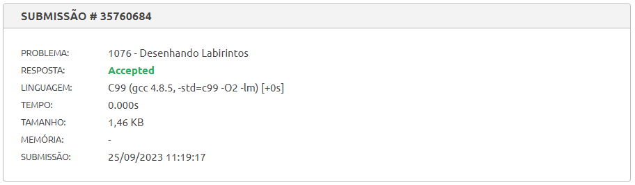
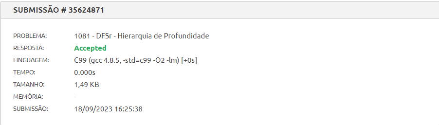
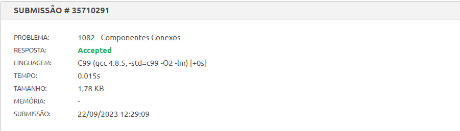
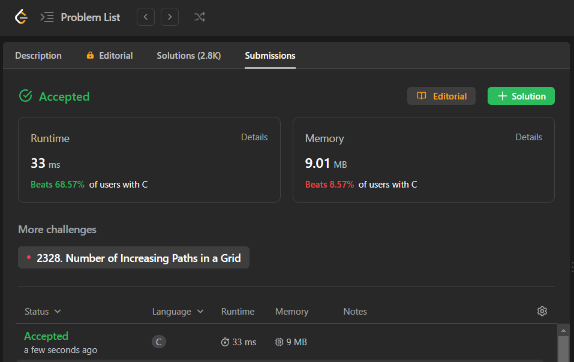

# Exercícios Resolvido de Juiz Online

Tema:

- Grafos1

## Alunos

| Matrícula  | Aluno                       |
| ---------- | --------------------------- |
| 19/0085045 | Brenno da Silva Oliveira    |
| 19/0087501 | Gabriel Marcolino Rodrigues |

## Sobre

Exercícios resolvidos dos juizes online Beecrowd e LeetCode. Foram resolvidos os seguintes exercícios, sendo eles 3 do Beecroew de nível 5 e um do LeetCode de nível difícil:

> [329. Longest Increasing Path in a Matrix](https://leetcode.com/problems/longest-increasing-path-in-a-matrix/description/) 
> [1076 - Desenhando Labirintos](https://www.beecrowd.com.br/repository/UOJ_1076.html) 
> [1081 - DFSr - Hierarquia de Profundidade](https://www.beecrowd.com.br/repository/UOJ_1081.html) 
> [1082 - Componentes Conectados](https://www.beecrowd.com.br/repository/UOJ_1082.html)

## Screenshots

## Instalação

**Linguagem**: C

## Uso

Para rodar os exercícios basta clonar o respositório e executar os seguintes comandos dentro da pasta do arquivo pelo terminal:

    gcc -o nome_arquivo nome_arquivo.c

 

    ./nome_arquivo.exe < nome_arquivo.txt

Outra forma é subtmeter os códigos dos exercícios pelo juiz online:

- [329. Longest Increasing Path in a Matrix](https://leetcode.com/problems/longest-increasing-path-in-a-matrix/description/)
- [1076 - Desenhando Labirintos](https://www.beecrowd.com.br/judge/pt/problems/view/1076)
- [1081 - DFSr - Hierarquia de Profundidade](https://www.beecrowd.com.br/judge/pt/problems/view/1081)
- [1082 - Componentes Conectados](https://www.beecrowd.com.br/judge/pt/problems/view/1082)

## Outros

[Vídeo de apresentação](https://youtu.be/_8WZiVterao)

